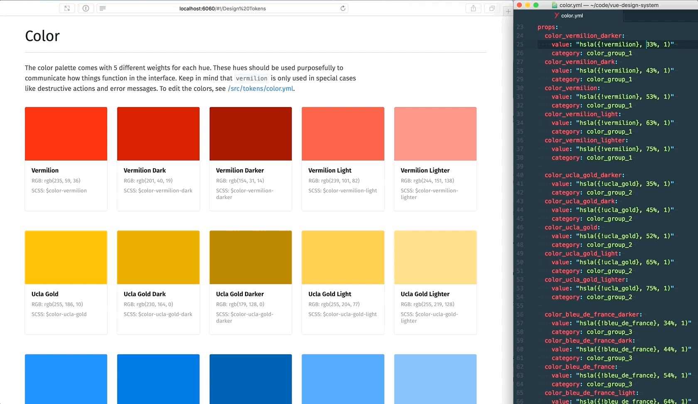

# Periodic - The AAP Design System

Just as the Periodic Table of Elements lets us see all of the elements that we have to work with in the material world, Periodic is our design system which lets us showcase all of the UI elements that we have to work with for all of our projects.

## Getting Started

This project is a fork of the fantastic [Vue Design System](https://github.com/viljamis/vue-design-system), tweaked to fit AAP's needs. All of the documentation listed below is on the official Vue Design System repo, which is 100% applicable to this repo as well.

## Documentation

- **[Getting Started](https://github.com/viljamis/vue-design-system/wiki/getting-started): How to install and run Vue Design System.**
- [Terminology](https://github.com/viljamis/vue-design-system/wiki/terminology): Introduction to the system concepts and its hierarchy.
- [Naming of Things](https://github.com/viljamis/vue-design-system/wiki/naming-of-Things): Naming is hard, so it’s good to have clear guidelines.
- [Directory Structure](https://github.com/viljamis/vue-design-system/wiki/directory-structure): What goes where and why.
- [Working with the System](https://github.com/viljamis/vue-design-system/wiki/working-with-the-system): Concrete examples on how to work with `Tokens`, `Elements` , `Patterns` and `Templates`.
- [Editing Living Documentation](https://github.com/viljamis/vue-design-system/wiki/editing-living-documentation): How to customize the living system documentation.
- [Spacing](https://github.com/viljamis/vue-design-system/wiki/spacing): A framework for creating a predictable and harmonious spacing.
- [Component Status](https://github.com/viljamis/vue-design-system/wiki/Component-Status): Clear labels that reflect the state of completion.
- [Component QA](https://github.com/viljamis/vue-design-system/wiki/Component-QA): How to review new components and keep the quality high.
- [Contributing](https://github.com/viljamis/vue-design-system/blob/master/CONTRIBUTING.md): A set of guidelines for contributing to the system.
- [Code of Conduct](https://github.com/viljamis/vue-design-system/blob/master/CODE_OF_CONDUCT.md): By participating you agree to abide by its terms.
- [Frequently Asked Questions](<https://github.com/viljamis/vue-design-system/wiki/frequently-asked-questions-(FAQ)>): How to use icons, how to use font-face, etc.

## License

Licensed under the [MIT license](https://github.com/viljamis/vue-design-system/blob/master/LICENSE).
